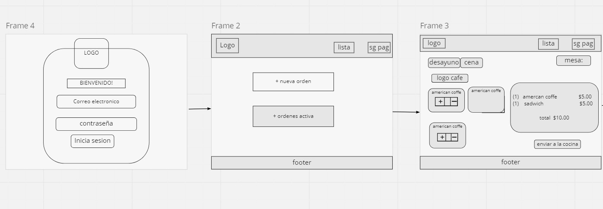
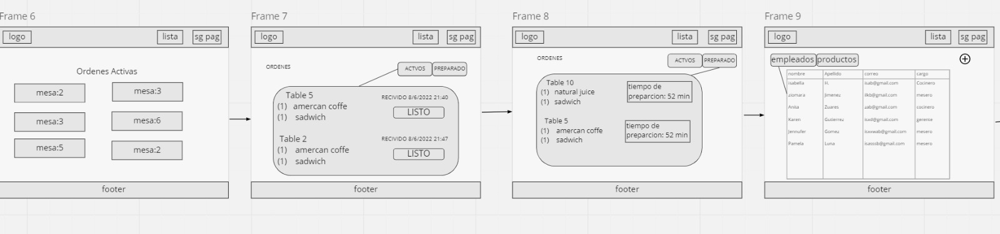
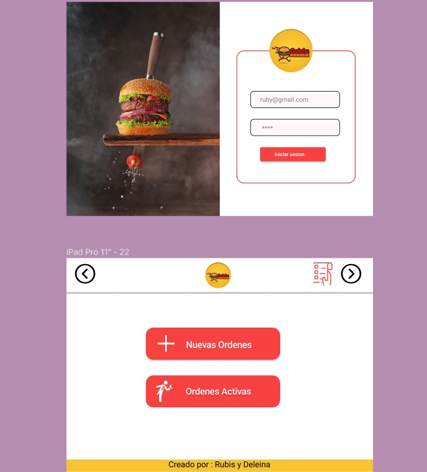
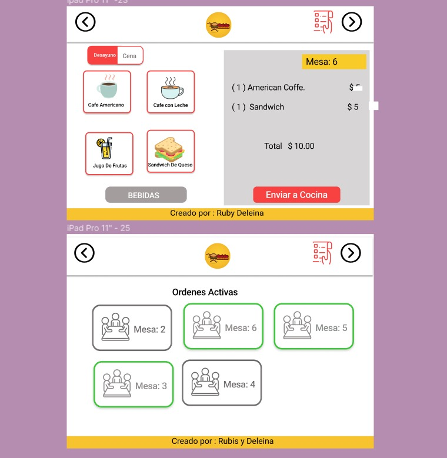
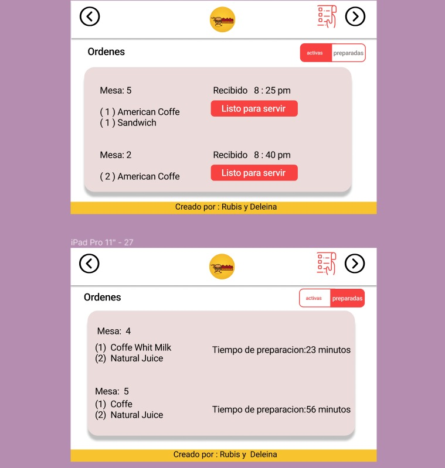
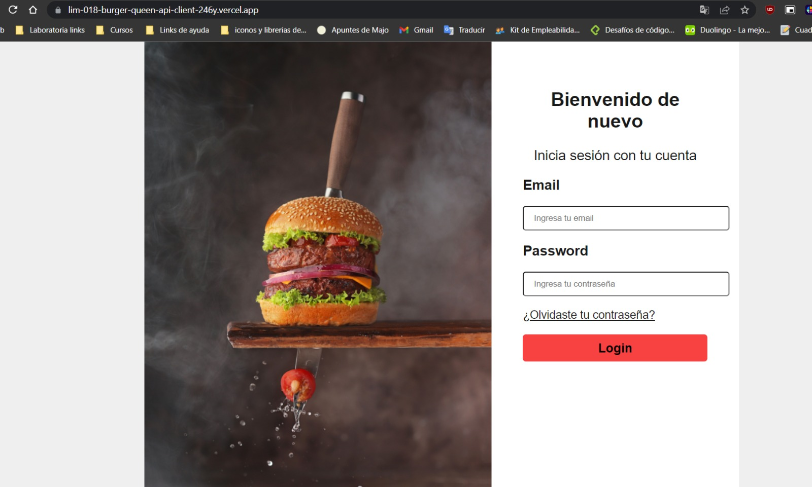

# BURGER QUEEN API CLIENT
## Indice
* [1. Descripción](#id1)
* [2. Prototipo de Baja Fidelidad](#id2)
* [3. Prototipo de Alta Fidelidad](#id3)
* [3.1. Tablet](#id5)
* [4. Vista Final del Proyecto](#id6)
* [4.1. Vista de Login](#id7)
* [4.3. Vista de Home](#id9)
* [5. Git Hub Pages](#id10)
* [6. Desarrolladoras del Proyecto](#id11)

## 1. Descripción 
Purr Love es un red social que conecta a aquellos que aman a los gatos, solo tienes que registrarte para poder inciar sesión e interactuar en esta comunidad.
Los usuarios pueden realizar publicaciones de texto y/o imágenes, editarlas, eliminarlas y reaccionar a otras publicaciones dandoles likes.

## 2. Prototipo de Baja Fidelidad 

## 3. Prototipo de Alta Fidelidad 

### Tablet
### 3.1. Tablet 

## 4. Vista Final del Proyecto 

### 4.1. Vista de Login 

## 5. Git Hub Pages 

## 6. Desarrolladoras del Proyecto: 

[Deleina Llamoca](https://github.com/Deleina)

[Rubis Rodri](https://github.com/RubisRodri)

